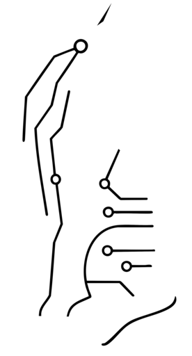

# jarndev.nvim

<div align="center">
  
  <p><em>A personal Neovim configuration — terminal-native, modular, no distribution layer.</em></p>
</div>

## What This Is

`jarndev.nvim` began as a fork of [kickstart.nvim](https://github.com/nvim-lua/kickstart.nvim)
and has since been restructured into a modular multi-file layout. It is **not** a
distribution: there is no framework or abstraction between you and the plugin specs.
Every plugin lives in its own file under `lua/plugins/config/<category>/` and returns a
plain [lazy.nvim](https://github.com/folke/lazy.nvim) spec.

Feature-wise it sits at or slightly past LazyVim parity, with a few things the common
distributions do not ship at all: an in-editor SQL client, an HTTP client, a dual
cloud/local AI stack, and full DAP wiring for Python, C/C++ and JavaScript.

Leader is <kbd>Space</kbd>. A Nerd Font is assumed (`vim.g.have_nerd_font = true`).

## Requirements

| Requirement | Notes |
| --- | --- |
| **Neovim ≥ 0.11** | Developed against 0.12.2. Uses `vim.lsp.config()`, `vim.diagnostic.jump()`, `vim.hl`, `vim.system` |
| `git`, `make`, `unzip`, `curl` | Plugin and Mason installs |
| A C compiler (`gcc`/`g++`) | Treesitter parsers, and the C/C++ debug flow |
| `ripgrep` | Backs the snacks picker and grep (`fd` optional, speeds up file finding) |
| Clipboard tool | `xclip`/`xsel`/`wl-clipboard` |
| A **Nerd Font** | Icons throughout |
| Node.js ≥ 20 | Required by several LSPs — **see [Required Setup](#required-setup)** |

Optional system binaries: `mpv` (video), `chafa` (dashboard logo fallback), `ollama`
(local AI), `gh` (GitHub review), `perf`/`valgrind` (profiling), `lazygit`, `lazydocker`.

## Install

This config is designed to run under a named Neovim profile rather than replacing
`~/.config/nvim`, so it can live alongside other configurations:

### Automated (Debian/Ubuntu and Arch/Omarchy)

```sh
curl -fsSL https://raw.githubusercontent.com/JarnDev/jarndev.nvim/master/os-custom-config/linux/install-nvim.sh | bash
```

Installs the system prerequisites (`apt` or `pacman`), Neovim, clones this repo, puts
Node on `PATH`, wires up the terminal, and runs the lazy + Mason bootstrap. Everything
is detected rather than assumed — package manager, Wayland vs X11 clipboard, terminal,
and whether a usable Neovim is already present — so it degrades sanely on an unfamiliar
distro instead of doing the wrong thing. It is idempotent, and prints whatever manual
steps are left. Use `--check` to see what it would do without changing anything:

```sh
bash os-custom-config/linux/install-nvim.sh --check
```

### Manual

```sh
git clone git@github.com:JarnDev/jarndev.nvim.git ~/.config/jarndev.nvim
NVIM_APPNAME=jarndev.nvim nvim
```

lazy.nvim bootstraps itself on first launch and installs everything; Mason then pulls the
LSP servers, formatters and linters. Watch progress with `:Lazy` and `:Mason`.

To make it the default profile, export the variable from your shell rc:

```sh
export NVIM_APPNAME="jarndev.nvim"
```

Data, state and installed tools then live under `~/.local/share/jarndev.nvim/`,
completely separate from any other Neovim setup.

## Required Setup

`install-nvim.sh` performs steps 1 and 3 automatically. Everything below is documented
in full, with verification commands, in
**[CLAUDE.md → Required Setup](CLAUDE.md#required-setup)**. These fail **silently** when
missing — the capability is simply absent rather than erroring:

1. **Node on `PATH`** — if `node`/`npm` come from lazy nvm shell functions, no Node LSP
   (`ts_ls`, `eslint`, `jsonls`, `html`, `cssls`, `tailwindcss`, `bashls`, `yamlls`,
   `dockerls`) can start, and Mason cannot install them.
2. **`gh auth login`** — required by octo.nvim.
3. **kitty pane navigation** — `kitty.conf` mappings so `<C-hjkl>` crosses kitty panes.
4. **clangd project indexing** — generate a `compile_commands.json`.
5. **Profiling** — `perf` / `valgrind`.

## Keymaps

Leader is <kbd>Space</kbd>. `:WhichKey` or simply pressing <kbd>Space</kbd> shows these
live; `<leader>sk` searches every mapping. `<leader>?` opens a Vim key reference drawer.

### Navigation

| Key | Action |
| --- | --- |
| `<leader><leader>` | Find open buffers |
| `<leader>sf` / `<leader>sg` / `<leader>sw` | Files / grep / word under cursor |
| `<leader>s.` `<leader>sp` `<leader>sr` | Recent files / projects / resume picker |
| `<leader>sh` `<leader>sk` `<leader>sd` `<leader>sn` | Help / keymaps / diagnostics / config |
| `<leader>/` · `<leader>s/` | Fuzzy search in buffer · in open buffers |
| `s` / `S` | Flash jump / flash treesitter select |
| `-` · `\` · `<leader>E` | Oil parent dir · Neo-tree (root) · Neo-tree (cwd) |
| `<leader>ja` `<leader>jj` `<leader>1`–`4` | Harpoon add / menu / slots |
| `<C-hjkl>` · `<A-hjkl>` | Move between splits · resize (kitty-aware) |
| `<leader>wp` | Pick window by letter |
| `]]` / `[[` | Next / previous LSP reference |
| `<leader><Tab>d/p/P/u/U` | Buffer close / pick / pin / reopen |

### LSP and code

| Key | Action |
| --- | --- |
| `gd` `gr` `gI` `gD` `<leader>D` | Definition / references / implementation / declaration / type def |
| `<leader>ds` · `<leader>ws` | Document · workspace symbols |
| `<leader>xs` | Symbol outline (Trouble) |
| `<leader>ci` · `<leader>co` | Incoming · outgoing calls |
| `K` · `gK` · mouse hover | LSP hover (bound on `LspAttach`) · hover.nvim provider picker · hover on mouse dwell |
| `<leader>cn` · `<leader>ca` | Rename (incremental) · code action |
| `<leader>ch` | Toggle inlay hints |
| `<leader>cr` · `<leader>cR` | Refactor menu · debug print var |
| `<leader>cd` · `<leader>cN` | Generate docstring · Neoconf settings |
| `<leader>cA` / `<leader>cP` | Swap parameter with next / previous |
| `<leader>f` | Format buffer |
| `<leader>xx` `<leader>xd` `<leader>xq` `<leader>xl` `<leader>xL` | Diagnostics / document / quickfix / loclist / lint |
| `]d` `[d` · `]x` `[x` | Next/prev diagnostic · Trouble item |

### Text objects and motions

| Key | Action |
| --- | --- |
| `af` / `if` | A / inner **function definition** (treesitter) |
| `ac` / `ic` · `aa` / `ia` | Class · parameter |
| `ao` / `io` · `au` / `iu` | Conditional or loop · function **call** |
| `]f` `[f` · `]F` `[F` | Next/prev function start · end |
| `]C` `[C` · `]a` `[a` | Next/prev class · parameter |
| `gsa` `gsd` `gsr` `gsf` | Surround add / delete / replace / find |
| `gc` `gcc` | Comment (context-aware in JSX via ts-comments) |
| `<M-D-hjkl>` | Move line or selection |

### Git

| Key | Action |
| --- | --- |
| `<leader>hs` `<leader>hr` `<leader>hS` `<leader>hR` `<leader>hu` | Stage / reset hunk, buffer, undo |
| `<leader>hp` `<leader>hb` `<leader>hB` `<leader>hd` `<leader>hD` `<leader>ht` | Preview / blame / diff / toggle deleted |
| `]c` / `[c` | Next / previous hunk |
| `<leader>gd` `<leader>gh` `<leader>gH` `<leader>gc` | Diffview: changes / file history / repo history / close |
| `<leader>gp` `<leader>gi` `<leader>gr` `<leader>gO` | Octo: PRs / issues / start review / actions |
| `<leader>gB` · `<leader>lg` | Open in browser · lazygit |

### Run, test, debug

| Key | Action |
| --- | --- |
| `<leader>tt` `<leader>tf` `<leader>ts` `<leader>to` `<leader>td` | Test nearest / file / summary / output / debug |
| `<leader>db` `<leader>dc` `<leader>di` `<leader>do` `<leader>dO` | Breakpoint / continue / step in / over / out |
| `<leader>du` `<leader>dr` `<leader>dl` `<leader>dt` | Debug UI / REPL / run last / terminate |
| `<leader>oo` `<leader>or` `<leader>oa` `<leader>oi` | Overseer tasks: toggle / run / action / info |
| `<leader>rr` `<leader>rR` `<leader>re` `<leader>ri` | Kulala HTTP (in `.http` files): run / run all / set env / inspect |
| `<leader>rv` · `<leader>mp` | Play video (mpv) · Markdown preview |
| `<leader>lt` · `<leader>ld` | Terminal · lazydocker |

### AI

| Key | Action |
| --- | --- |
| `<leader>aa` `<leader>ai` `<leader>ap` | CodeCompanion chat / inline / action palette |
| `<leader>ac` (visual) · `<leader>aL` | Add selection to chat · local Ollama chat |
| `<leader>aT` · `<leader>af` | Claude Code terminal · focus |
| `<leader>at` | Toggle ghost text: Copilot ↔ local Ollama |
| `<M-l>` (insert) | Accept Copilot suggestion |

### Editing and UI

| Key | Action |
| --- | --- |
| `p` / `P` · `<C-p>` / `<C-n>` · `<leader>p` | Paste (yank ring) · cycle ring · pick from history |
| `<C-a>` / `<C-x>` | Increment / decrement — ints, bools, dates, hex, semver |
| `<leader>S` · `<leader>sR` | Search & replace (grug-far) · replace word under cursor |
| `<leader>qs` / `<leader>qd` | Session search / delete |
| `<leader>uc` `<leader>uC` `<leader>us` `<leader>ue` | Color picker / shades / startup time / edgy |
| `<leader>H` · `<RightMouse>` | Dashboard · context menu |

## Plugins

| Category | Plugins |
| --- | --- |
| **Core** | lazy.nvim, snacks.nvim (picker, dashboard, terminal, lazygit, indent, notifier, scroll, words, image) |
| **LSP** | nvim-lspconfig, mason + mason-lspconfig + mason-tool-installer, fidget, lazydev, neoconf |
| **Completion** | blink.cmp (LSP, snippets, path, buffer, copilot, minuet, dadbod), LuaSnip |
| **Treesitter** | nvim-treesitter (`main`), textobjects, context, autotag |
| **Editing** | mini.ai / surround / move / hipatterns, yanky, dial, autopairs, flash, ts-comments, vim-sleuth |
| **Navigation** | harpoon2, smart-splits, window-picker, oil.nvim, neo-tree, bufferline |
| **Refactor** | refactoring.nvim, inc-rename, neogen, grug-far |
| **Git** | gitsigns, diffview, octo |
| **Test / Debug** | neotest (python, jest), nvim-dap + dap-ui + virtual-text, codelldb, debugpy, js-debug |
| **Tasks** | overseer.nvim |
| **Formatting** | conform.nvim — stylua, prettierd, ruff, clang-format, cmake-format |
| **Linting** | nvim-lint — ruff, eslint_d, markdownlint-cli2, shellcheck |
| **Database** | vim-dadbod + dadbod-ui + dadbod-completion |
| **HTTP** | kulala.nvim |
| **AI** | claudecode.nvim, codecompanion.nvim, copilot.vim, minuet-ai (Ollama) |
| **UI** | tokyonight, lualine, noice, trouble, todo-comments, edgy, smear-cursor, minty/menu, which-key |

Language servers configured: `lua_ls`, `ts_ls`, `eslint`, `jsonls`, `html`, `cssls`,
`tailwindcss`, `pyright`, `marksman`, `bashls`, `yamlls`, `taplo`, `dockerls`, `clangd`,
`cmake`.

## Layout

```text
init.lua              -- requires bootstrap -> core -> plugins
lua/
  bootstrap/          leader key, Nerd Font flag, lazy.nvim install
  core/               options.lua, autocommands.lua
  keymaps/            global keymaps
  plugins/
    init.lua          lazy.setup() -- imports every category
    config/
      ai/ completion/ database/ editor/ formatting/ git/
      lsp/ terminal/ testing/ treesitter/ ui/
```

To add a plugin: drop a file returning a lazy spec into the right category directory,
then add `{ import = 'plugins.config.<category>.<name>' }` to that category's `init.lua`.

## Useful Commands

| Command | Purpose |
| --- | --- |
| `:Lazy` | Plugin manager — update, install, profile |
| `:Mason` | LSP / tool installer |
| `:ConformInfo` | Formatter status for the buffer |
| `:Neoconf` | Project-local settings |
| `:DBUI` / `:DBUIToggle` | SQL client (vim-dadbod-ui) — no keymap, commands only |
| `:checkhealth` | Full diagnostic health check |
| `:StartupTime` | Startup profiling |

## Notes

- **Formatting** runs on save (conform, with LSP fallback). `stylua` enforces Lua style —
  2-space indent, 160 columns, single quotes.
- **`lazy-lock.json` is currently gitignored.** lazy.nvim
  [recommends tracking it](https://lazy.folke.io/usage/lockfile) so plugin versions are
  reproducible across machines; remove it from `.gitignore` if you want that.
- **kitty** should come from the upstream installer
  (`os-custom-config/linux/install-kitty.sh`) — Ubuntu's apt build 0.32.2 doubles
  Backspace and Enter under the Kitty Keyboard Protocol. Fixed in 0.33.

Architecture decisions and gotchas are documented in [CLAUDE.md](CLAUDE.md).

## License

MIT — see [LICENSE.md](LICENSE.md). Originally derived from
[kickstart.nvim](https://github.com/nvim-lua/kickstart.nvim).
